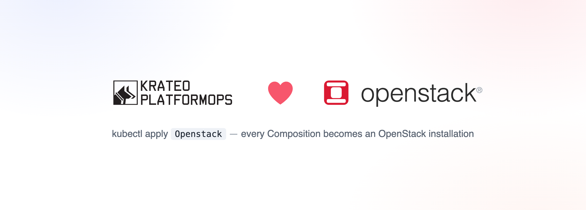
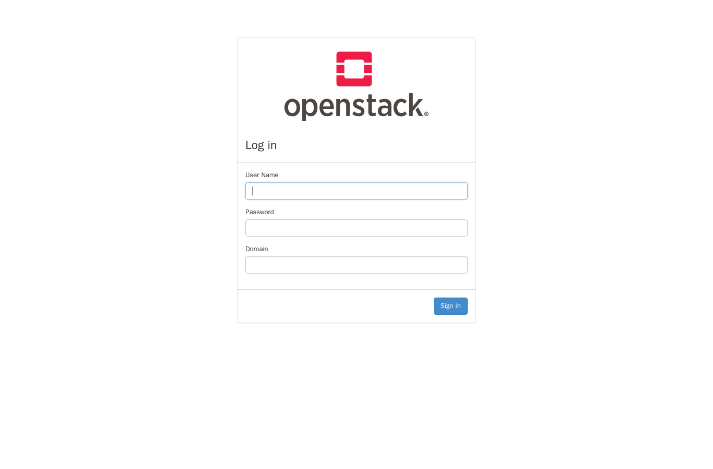
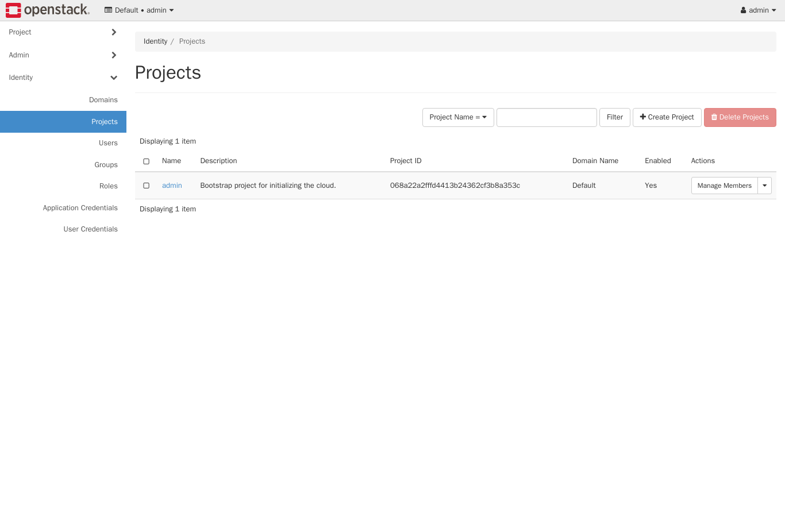

<p align="center">
  
</p>

# Krateo Blueprints — OpenStack

A set of [Krateo](https://krateo.io) blueprints that install OpenStack on Kubernetes using the
upstream [OpenStack-Helm](https://opendev.org/openstack/openstack-helm) charts. **OpenStack-Helm
ships one Helm chart per service**, so this repo provides **one blueprint per chart** — each a
`CompositionDefinition` whose Compositions install that single component. "One OpenStack
installation" is then a *set* of Compositions deployed into one namespace.

## Why one blueprint per chart (and not an umbrella)

The design rule: *put components in separate blueprints when they are separate Helm charts;
only merge them into an umbrella blueprint when one blueprint's input depends on another
blueprint's output.* We verified the OpenStack-Helm charts against that rule:

- **No input→output dependencies.** Every cross-component reference is **static configuration** —
  a fixed in-cluster Service DNS name (`keystone`, `mariadb`, `rabbitmq`, …) plus shared static
  passwords (all default to `password`). No chart reads another's *runtime* output; the
  helm-toolkit `*_lookup` helpers are compile-time template functions over the static `endpoints`
  map, not Kubernetes runtime lookups.
- **Ordering is automatic across compositions.** OpenStack-Helm gates every pod/job on its
  dependencies via `kubernetes-entrypoint` init-containers that wait on Services/Jobs *by name*.
  Those names are fixed, so the checks resolve across separate Compositions in the same namespace
  (e.g. Glance waits for the `keystone-api` Service and `mariadb` regardless of which blueprint
  created them).
- **Shared secrets are shared *inputs*, not outputs.** The few cross-cutting secrets (MariaDB
  root, RabbitMQ admin, Keystone admin passwords) are identical static defaults; to customise them
  you set the same value (or reference one pre-created `Secret`) in each Composition.

So separate blueprints are correct here. An umbrella would only be required if we switched to
**generated** secrets — then Keystone/DB/RabbitMQ passwords would become outputs the other
components consume, which *is* an input→output dependency.

There is, however, a real **ordering** dependency (Keystone must be Ready before Glance/Nova/Neutron
register), and creating all the Compositions at once races (a slow Keystone install trips Krateo's
`create-pending` guard). So on top of the per-component blueprints there is an **orchestrator
umbrella blueprint** (`blueprints/openstack`, Kind `Openstack`): its chart registers all the
component `CompositionDefinition`s, then emits each component `Composition` only once its CRD exists
**and** all its dependency Compositions report `Ready=True` (Helm `lookup`, re-evaluated every
reconcile). One `Openstack` Composition therefore rolls out a whole install in dependency order —
verified end-to-end (`mariadb`+`memcached` → `keystone` → `glance`+`horizon`, then `token issue`).

## The blueprints

| Blueprint (`blueprints/<c>`) | Chart / Kind            | Role                        | Tier      |
| ---------------------------- | ----------------------- | --------------------------- | --------- |
| `mariadb`                    | `Mariadb`      | Relational datastore        | identity  |
| `memcached`                  | `Memcached`    | Token/catalog cache         | identity  |
| `keystone`                   | `Keystone`     | **Identity** (the core)     | identity  |
| `glance`                     | `Glance`       | Image service               | identity  |
| `horizon`                    | `Horizon`      | Dashboard (web UI)          | identity  |
| `rabbitmq`                   | `Rabbitmq`     | Message bus                 | compute   |
| `placement`                  | `Placement`    | Resource placement          | compute   |
| `openvswitch`                | `Openvswitch`  | OVS datapath agent          | compute   |
| `libvirt`                    | `Libvirt`      | libvirt/QEMU hypervisor     | compute   |
| `nova`                       | `Nova`         | Compute (VMs, QEMU)         | compute   |
| `neutron`                    | `Neutron`      | Networking (ML2/OVS, VXLAN) | compute   |
| `ironic`                     | `Ironic`       | Bare-metal provisioning (ipmi/redfish, iPXE) | compute   |
| `cinder`                     | `Cinder`       | Block storage (volumes)     | compute   |
| `heat`                       | `Heat`         | Orchestration (stacks)      | compute   |
| `barbican`                   | `Barbican`     | Key manager (secrets)       | compute   |
| `designate`                  | `Designate`   | DNS service (zones/records) | compute   |
| `octavia`                    | `Octavia`     | Load balancing (LBaaS)      | compute   |
| `magnum`                     | `Magnum`      | Container infra (k8s)       | compute   |
| `manila`                     | `Manila`      | Shared filesystems          | compute   |
| `mistral`                    | `Mistral`     | Workflow service            | compute   |
| `ceilometer`                 | `Ceilometer`  | Telemetry collection        | compute   |
| `aodh`                       | `Aodh`        | Alarming service            | compute   |
| `cloudkitty`                 | `Cloudkitty`  | Rating/chargeback           | compute   |
| `masakari`                   | `Masakari`    | Instances HA                | compute   |
| `trove`                      | `Trove`       | Database as a service       | compute   |
| `watcher`                    | `Watcher`     | Resource optimization       | compute   |
| `tacker`                     | `Tacker`      | NFV orchestration           | compute   |
| `cyborg`                     | `Cyborg`      | Accelerator mgmt            | compute   |
| `blazar`                     | `Blazar`      | Resource reservation        | compute   |
| `zaqar`                      | `Zaqar`       | Messaging service           | compute   |
| `freezer`                    | `Freezer`     | Backup as a service         | compute   |
| `skyline`                    | `Skyline`     | Modern dashboard            | compute   |
| `openstack`                  | `Openstack`             | **Orchestrator** (sequences the above) | umbrella |

Each blueprint is **self-contained**: `blueprints/<c>/chart/` vendors the OpenStack-Helm chart
(plus `helm-toolkit`), pinned to release **2025.1 "Epoxy"** (`ubuntu_jammy` images), with the
Helm-hook job annotations stripped so Krateo's composition-dynamic-controller (which runs under a
least-privilege ServiceAccount) can install them as plain, self-ordered resources. A small,
curated `values.schema.json` drives each Composition CRD.

## Scope / what's verified

- **Identity plane — fully working, composition-driven**, on both kind (amd64 emulation) and GKE
  (native): MariaDB + Memcached + Keystone (+ Glance + Horizon). `openstack token issue`,
  `endpoint/service/user/catalog list` all succeed; the Horizon UI logs in (screenshots below).
- **Compute plane — fully working, composition-driven** on an amd64 cluster with the Open vSwitch
  kernel module (e.g. Ubuntu GKE nodes): OVS datapath (`br-int`/`br-tun`), Neutron (ML2/OVS, VXLAN),
  Nova control services, and libvirt with **QEMU** software virtualization (no `/dev/kvm` needed).
  `nova-compute` registers as a hypervisor, all four Neutron agents come up, and a **CirrOS VM boots
  to `ACTIVE`** (Neutron DHCP lease, serial console to login prompt). Two determinism fixes were
  required for the Krateo CDC path — see [`docs/medium-openstack-as-a-service.md`](docs/medium-openstack-as-a-service.md).
  Compute is **not** possible on kind/Apple-Silicon (no `/dev/kvm`, arm64-only) — use GKE, see
  [`quickstart-gke.md`](quickstart-gke.md).
- **Bare-metal plane (`ironic`) — production-grade blueprint, composition-driven**: real driver stack
  (`ipmi`/`redfish`, iPXE/PXE/TFTP/HTTP boot), conductor on `hostNetwork`, provisioning-network wiring,
  with the same hook-strip + determinism fixes as the rest. On a cloud-only cluster (GKE) the API and
  Keystone `baremetal` catalog registration come up; **actually provisioning a node requires real
  hardware** — a node on the provisioning L2 with the PXE NIC (default `ironic-pxe`) labelled
  `openstack-control-plane=enabled`, plus BMCs. Pairs with the
  [`openstack-ironic-operator-kog`](https://github.com/braghettos/openstack-ironic-operator-kog) KOG
  operator, which drives the Ironic API to enrol/provision nodes as Kubernetes CRs.

## Install

### Recommended: one orchestrator Composition

```sh
# Register only the orchestrator blueprint...
kubectl create namespace openstack-system
kubectl apply -f blueprints/openstack/compositiondefinition.yaml

# ...then one Composition rolls out a whole install in dependency order.
kubectl create namespace openstack
kubectl apply -f examples/openstack.yaml         # Kind: Openstack, spec.profile: identity | full
```

The orchestrator registers the component `CompositionDefinition`s itself and emits each component
`Composition` in order as its dependencies become Ready. `profile: identity` brings up
MariaDB+Memcached+Keystone+Glance+Horizon; `profile: full` also adds the compute plane (needs an
amd64 cluster with the OVS kernel module — see [`quickstart-gke.md`](quickstart-gke.md)).

### Or drive the per-component blueprints directly

```sh
kubectl create namespace openstack-system
for c in mariadb memcached keystone glance horizon; do
  kubectl apply -f blueprints/$c/compositiondefinition.yaml; done
kubectl create namespace openstack
kubectl apply -f examples/01-identity.yaml       # one Composition per component
# kubectl apply -f examples/02-compute.yaml      # compute plane (GKE)
```

Each Composition's `spec` is the curated chart values (e.g. `images.pull_policy`, replica counts,
`neutron.network.interface.tunnel`, `nova.conf.nova.libvirt.virt_type`). Empty `spec: {}` uses the
validated defaults.

## The dashboard (Horizon)

Logged in as `admin` / `password` (domain `Default`); the Identity panels are populated by Keystone:

| Login | Identity → Projects (admin) |
| ----- | --------------------------- |
|  |  |

## Accessing OpenStack

From inside the cluster use the **internal** Keystone interface (`keystone-api:5000`):

```sh
kubectl -n openstack run osclient --rm -it --restart=Never \
  --image=quay.io/airshipit/openstack-client:2025.1-ubuntu_jammy \
  --env OS_AUTH_URL=http://keystone-api.openstack.svc.cluster.local:5000/v3 \
  --env OS_USERNAME=admin --env OS_PASSWORD=password --env OS_PROJECT_NAME=admin \
  --env OS_USER_DOMAIN_NAME=Default --env OS_PROJECT_DOMAIN_NAME=Default \
  --env OS_IDENTITY_API_VERSION=3 --env OS_REGION_NAME=RegionOne --env OS_INTERFACE=internal \
  --command -- openstack token issue
```

## Quickstarts

- [`quickstart-kind.md`](quickstart-kind.md) — identity plane on a local kind cluster (Apple
  Silicon supported via amd64 image pre-loading).
- [`quickstart-gke.md`](quickstart-gke.md) — disposable GKE cluster with the compute plane
  (Nova/QEMU, Neutron/OVS).

## Publishing (CI)

`.github/workflows/release-tag.yaml` packages every `blueprints/*/chart` and pushes each to GHCR
on a semver tag (`git tag 0.1.0 && git push origin 0.1.0` →
`oci://ghcr.io/braghettos/charts/<component>:0.1.0`). `.github/workflows/lint.yaml`
runs `helm lint` + `helm template` on every chart per PR.
