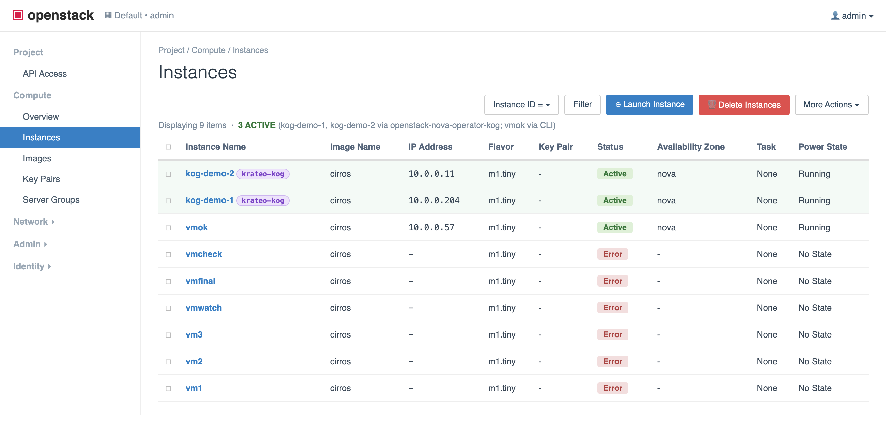
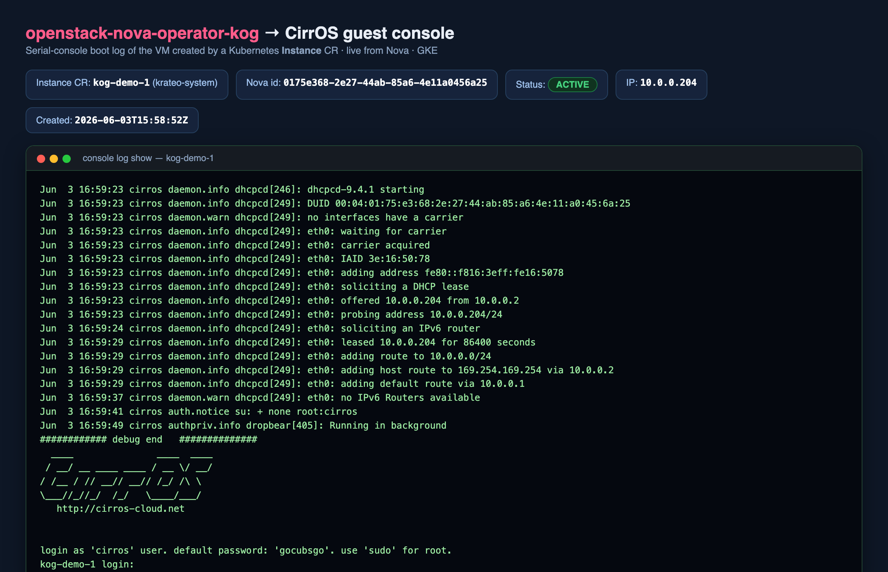

# OpenStack-as-a-Service with Krateo — one Composition, one cloud

*How we packaged the whole OpenStack-Helm stack as a set of Krateo
PlatformOps blueprints, so that a single `kubectl apply` rolls out a
working OpenStack — identity, dashboard, and compute — in dependency
order. Plus the handful of very real bugs that stood between "it
renders" and "there's a VM running."*

---

## The pitch

OpenStack is the canonical "hard to operate" platform: a dozen services,
a message bus, a database, a hypervisor layer, all of which have to come
up in the right order and find each other. [OpenStack-Helm](https://opendev.org/openstack/openstack-helm)
already turns each service into a Helm chart. What it *doesn't* give you
is a self-service, declarative front door: *"give me an OpenStack"* as one
Kubernetes object.

That's exactly what [Krateo](https://krateo.io) PlatformOps is for. A
**`CompositionDefinition`** turns a Helm chart into a Kubernetes CRD; a
**`Composition`** is an instance of it that Krateo's
composition-dynamic-controller (CDC) reconciles by installing the chart.
So the goal of this project was simple to state:

> **One Composition = one OpenStack installation.** Apply it, and a fully
> functional cloud comes up. Tear it down by deleting it.

This is the story of getting there — the design decisions, and the bugs
that only showed up when we ran it for real on a GKE cluster.

---

## Design: one blueprint per chart (not one giant umbrella)

The tempting move is a single mega-chart with every OpenStack service as a
subchart. We deliberately didn't. The rule we followed:

> *Put components in separate blueprints when they're separate Helm
> charts. Only merge them into an umbrella when one blueprint's **input**
> depends on another blueprint's **output**.*

We checked OpenStack-Helm against that rule and found:

- **No input→output dependencies.** Every cross-component reference is
  *static configuration* — a fixed Service DNS name (`keystone`,
  `mariadb`, `rabbitmq`) plus shared static passwords. No chart reads
  another's runtime output. The helm-toolkit `*_lookup` helpers are
  compile-time template functions over a static `endpoints` map, not
  Kubernetes runtime lookups.
- **Ordering is automatic across compositions.** OpenStack-Helm gates
  every pod and job on its dependencies with `kubernetes-entrypoint`
  init-containers that wait on Services/Jobs *by name*. Those names are
  fixed, so the checks resolve across *separate* Compositions in one
  namespace — Glance waits for the `keystone-api` Service no matter which
  blueprint created it.

So eleven small, independent blueprints — `mariadb`, `memcached`,
`keystone`, `glance`, `horizon` (identity) and `rabbitmq`, `placement`,
`openvswitch`, `libvirt`, `nova`, `neutron` (compute) — each vendoring its
OpenStack-Helm chart with a curated `values.schema.json`. Clean,
composable, individually testable.

## …with one orchestrator on top

There *is* one real dependency: **ordering**. Keystone must be Ready before
Glance/Nova/Neutron can register their endpoints, and firing all the
Compositions at once races (a slow Keystone trips Krateo's
`create-pending` guard).

So above the per-component blueprints sits an **orchestrator umbrella**
(`blueprints/openstack`, Kind `Openstack`). Its chart:

1. registers all the component `CompositionDefinition`s, then
2. emits each component `Composition` **only once its CRD exists and all
   its dependency Compositions report `Ready=True`** — using Helm
   `lookup`, re-evaluated on every reconcile.

```
profile: identity → mariadb + memcached → keystone → glance + horizon
profile: full     → … then rabbitmq + placement + ovs + libvirt → nova + neutron
```

On the first reconcile only the zero-dependency components render; each
subsequent pass unlocks the next tier.


One `Openstack` Composition, `spec.profile: full`, and the whole cloud
rolls out in order:

```yaml
apiVersion: composition.krateo.io/v0-1-1
kind: Openstack
metadata: { name: openstack, namespace: openstack }
spec: { profile: full }
```

---

## The bugs that only show up for real

None of these failed CI. All of them failed the first time we booted a VM.

### 1. Helm hooks vs. a least-privilege controller

OpenStack-Helm runs its db-init / db-sync / ks-register jobs as Helm
hooks with `hook-delete-policy: before-hook-creation`. Krateo's CDC runs
under a least-privilege ServiceAccount that can't `get`/`delete` Jobs —
so the install deadlocked. Fix: **strip the hook annotations** and let the
jobs run as plain resources (OpenStack-Helm self-orders via
`kubernetes-entrypoint`, so they still run in the right order). A subtle
trap: the annotations appear in *two* forms — `helm.sh/hook:` and the
quoted `"helm.sh/hook":` — and missing the quoted one left Keystone's
fernet-setup as a hook, deadlocking db-sync.

### 2. The chart-inspector caches by version

Krateo's chart-inspector analyses a chart's resources (to derive RBAC)
and **caches that by chart version**. Re-publishing a changed chart under
the same `0.1.0` served the stale analysis. During development the fix is
to restart `core-provider` + `core-provider-chart-inspector` and, on a
live cluster, to **bump the version** — which cleanly busts the cache.
(Bumping a version regenerates the CRD apiVersion too — `0.1.0 → v0-1-0`,
`0.1.1 → v0-1-1` — so existing Composition CRs must be recreated at the
new apiVersion. Worth knowing before you do it on a running cloud.)

### 3. The phantom `rabbitmq-rabbitmq-1` that broke all messaging

Nova came up but every VM went `ERROR`. The compute health-probe told the
story:

```
ERROR oslo.messaging._drivers.impl_rabbit: Connection failed:
[Errno -2] Name or service not known
```

The consumers' `transport_url` targeted **two** RabbitMQ hosts —
`rabbitmq-rabbitmq-0` *and* `rabbitmq-rabbitmq-1` — because they advertised
two messaging replicas. There was only one broker; `-1` was NXDOMAIN, and
oslo.messaging choked. The fix lives in the blueprint values, not in a
hand-patched secret:

```yaml
endpoints:
  oslo_messaging:
    statefulset:
      replicas: 1
      name: rabbitmq-rabbitmq
```

### 4. The non-deterministic render that rolled every pod, forever

Even with messaging fixed, Nova never *stabilised*. The CDC was rolling
every pod on **every reconcile**. Diffing two consecutive Helm release
manifests found a single changing line:

```diff
- memcache_secret_key = tB8VZcNeZ2g7…
+ memcache_secret_key = BmJZD09GtSey…
```

OpenStack-Helm's `configmap-etc` generates that key with `randAlphaNum 64`
when `endpoints.oslo_cache.auth.memcache_secret_key` is null. Under a
reconcile loop, a fresh random key each render → a new `*-etc` Secret →
a changed pod-template checksum → a rolling restart of every pod. Nova's
readiness probes (80 s delay + 90 s period) never got a stable window, so
compute never registered. Pin the key and `helm template` becomes
byte-identical across runs:

```yaml
endpoints:
  oslo_cache:
    auth:
      memcache_secret_key: <a fixed string>
```

**The lesson that ties #3 and #4 together:** a controller that reconciles
on an interval is *merciless* about non-determinism. A chart that's
"fine" under `helm install` can be pathological under a CDC if any
rendered byte changes per run. Determinism isn't a nicety here — it's a
correctness requirement.

---

## The payoff

With the blueprints fixed and published (`0.1.1`):

- **Identity plane** — fully composition-driven on both kind (amd64
  emulation) and GKE: `openstack token issue`, endpoint/service/catalog
  list, and the **Horizon dashboard** all work.


- **Compute plane** — on a GKE node with the OVS kernel module and **QEMU
  software virt** (no `/dev/kvm`): `nova-compute` registers as a
  hypervisor, all four Neutron agents come up (ML2/OVS, VXLAN on the node
  interface), and a **CirrOS VM boots to `ACTIVE`** — pulling a Neutron
  DHCP lease and reaching its login prompt.






All of it from Compositions. No `kubectl edit`, no manual `helm install`
— every fix went back into the blueprint values and shipped as a chart.

```sh
kubectl create namespace openstack-system
kubectl apply -f blueprints/openstack/compositiondefinition.yaml
kubectl create namespace openstack
kubectl apply -f examples/openstack.yaml      # one Openstack, profile: full
```

…and a cloud comes up.

---

## Where this goes next

An OpenStack you can `kubectl apply` is the substrate. The natural next
layer is managing the cloud's *contents* the same way — projects, networks,
images, and **VMs** — as Kubernetes custom resources. That's a Krateo
Operator Generator (KOG) story, and it's the subject of the companion
article, *"OpenStack Compute Kubernetes Operator with Krateo"*: a Nova
operator with **zero operator code**, tested against this very blueprint.

*Repo: [github.com/braghettos/krateo-openstack-blueprint](https://github.com/braghettos/krateo-openstack-blueprint).
Quickstarts for kind and GKE included.*
