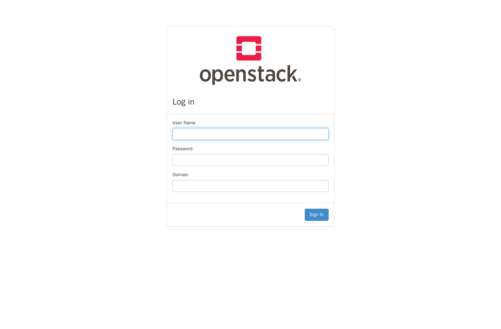

# Quickstart (GKE) — OpenStack with compute (Nova/QEMU)

kind on Apple Silicon cannot run compute (no `/dev/kvm`, arm64-only images). A **disposable GKE
cluster** with **Ubuntu** nodes runs the amd64 OpenStack images natively and provides the Open
vSwitch kernel datapath Neutron needs, with Nova using **QEMU** software virtualization (no KVM).

## 1. Disposable cluster

A single Ubuntu node with the OVS/vxlan kernel modules is enough.

```sh
gcloud container clusters create osh --zone us-central1-a --num-nodes 1 \
  --machine-type e2-standard-8 --image-type UBUNTU_CONTAINERD \
  --disk-type pd-standard --disk-size 100 --no-enable-autoupgrade --no-enable-autorepair
gcloud container clusters get-credentials osh --zone us-central1-a

# Label the node for all OpenStack roles
kubectl label --overwrite nodes --all \
  openstack-control-plane=enabled openstack-compute-node=enabled \
  openvswitch=enabled l3-agent=enabled
```

The Ubuntu node image already has the `openvswitch` and `vxlan` kernel modules; the OVS chart
loads them. The node's primary NIC is `ens4` — the default for `neutron.network.interface.tunnel`.

## 2. Krateo + register every blueprint

```sh
helm repo add jetstack https://charts.jetstack.io
helm repo add krateo https://charts.krateo.io && helm repo update
helm upgrade --install cert-manager jetstack/cert-manager -n cert-manager \
  --create-namespace --set crds.enabled=true --wait
helm upgrade --install core-provider krateo/core-provider \
  --version 1.0.0 -n krateo-system --create-namespace --wait

kubectl create namespace openstack-system
for c in mariadb memcached keystone glance horizon rabbitmq placement openvswitch libvirt nova neutron; do
  kubectl apply -f blueprints/$c/compositiondefinition.yaml
done
```

No image pre-loading is needed — GKE nodes are amd64, so the OpenStack images pull and run natively.

## 3. Deploy one OpenStack install

**Recommended — the orchestrator** (registers the component blueprints and rolls them out in
dependency order):

```sh
kubectl apply -f blueprints/openstack/compositiondefinition.yaml
kubectl wait compositiondefinition/openstack -n openstack-system --for=condition=Ready --timeout=180s
kubectl create namespace openstack
sed 's/profile: identity/profile: full/' examples/openstack.yaml | kubectl apply -f -
```

**Or the per-component Composition sets** (register the component CompositionDefinitions from step 2 first):

```sh
kubectl create namespace openstack
kubectl apply -f examples/01-identity.yaml      # mariadb, memcached, keystone, glance, horizon
kubectl apply -f examples/02-compute.yaml       # rabbitmq, placement, ovs, libvirt, nova, neutron
```

The compute Compositions inherit the validated defaults: Nova `virt_type: qemu`, Neutron single-node
ML2/OVS over VXLAN on `ens4`, no external provider bridge. To override per Composition, e.g.:

```yaml
apiVersion: composition.krateo.io/v0-1-0
kind: OpenstackNeutron
metadata: { name: openstack-neutron, namespace: openstack }
spec:
  network: { interface: { tunnel: ens4 } }   # set to your node's primary NIC
```

## 4. Verify

Identity (works natively, no emulation):

```sh
kubectl -n openstack run osclient --restart=Never --image=quay.io/airshipit/openstack-client:2025.1-ubuntu_jammy \
  --env OS_AUTH_URL=http://keystone-api.openstack.svc.cluster.local:5000/v3 \
  --env OS_USERNAME=admin --env OS_PASSWORD=password --env OS_PROJECT_NAME=admin \
  --env OS_USER_DOMAIN_NAME=Default --env OS_PROJECT_DOMAIN_NAME=Default \
  --env OS_IDENTITY_API_VERSION=3 --env OS_REGION_NAME=RegionOne --env OS_INTERFACE=internal \
  --command -- sleep 1d
kubectl exec -n openstack osclient -- openstack token issue
```

Compute (after the compute Compositions converge):

```sh
kubectl exec -n openstack osclient -- openstack --os-interface internal compute service list
kubectl exec -n openstack osclient -- openstack --os-interface internal hypervisor list
kubectl exec -n openstack osclient -- openstack --os-interface internal network agent list
```

libvirt reports **QEMU 8.2.2** with `domain type='qemu'` (software virtualization). The OVS agent
brings up `br-int`/`br-tun`. Booting a CirrOS instance to `ACTIVE` (register image → create
network/subnet → `openstack server create`) is the last-mile step; Nova/Neutron agent
registration on GKE is being finalised.

## The dashboard (Horizon)

Once Horizon is up, log in as `admin` / `password`, domain `Default`:

| Login | Identity → Projects (logged in as admin) |
| ----- | ---------------------------------------- |
|  |  |

**Expose it with a LoadBalancer (recommended on GKE).** The `horizon` blueprint supports
`network.dashboard.service.type: LoadBalancer`, which makes GKE provision an external L4 load
balancer with a public IP for the `horizon-int` Service. Set it on the Composition:

```yaml
apiVersion: composition.krateo.io/v0-1-0
kind: OpenstackHorizon
metadata: { name: openstack-horizon, namespace: openstack }
spec:
  network:
    dashboard:
      service:
        type: LoadBalancer
        # annotations:                                  # optional cloud-LB controls, e.g.
        #   networking.gke.io/load-balancer-type: "Internal"
```

```sh
kubectl apply -f - <<'EOF'
apiVersion: composition.krateo.io/v0-1-0
kind: OpenstackHorizon
metadata: { name: openstack-horizon, namespace: openstack }
spec: { network: { dashboard: { service: { type: LoadBalancer } } } }
EOF

# wait for the external IP, then open http://<EXTERNAL-IP>
kubectl -n openstack get svc horizon-int -w
```

Verified on GKE: `horizon-int` became `type: LoadBalancer` with a public IP, and the dashboard
served on it (`HTTP 200`, login page):



(Default is `NodePort` on `31000`; `port-forward svc/horizon-int 8080:80` also works for a quick look.)

## Teardown (important — this cluster costs money)

```sh
gcloud container clusters delete osh --zone us-central1-a --quiet
```
